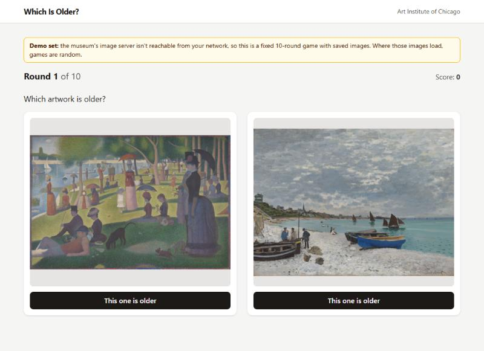
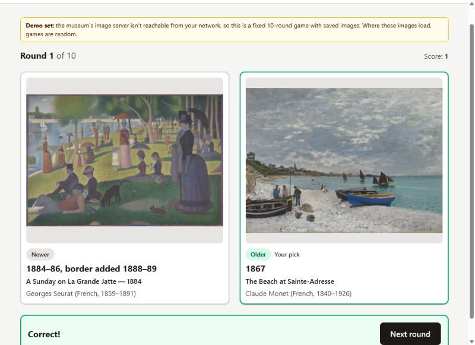
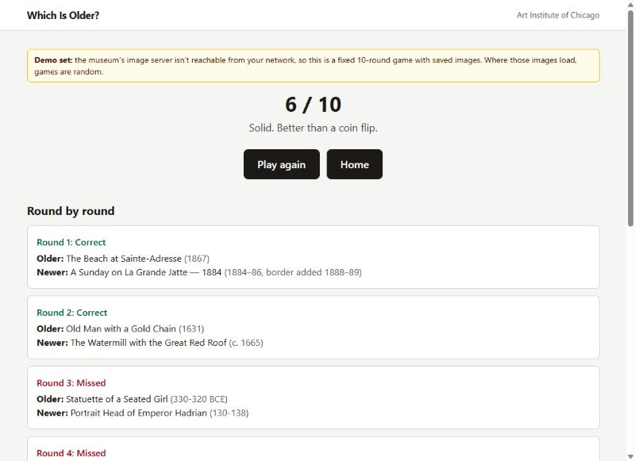
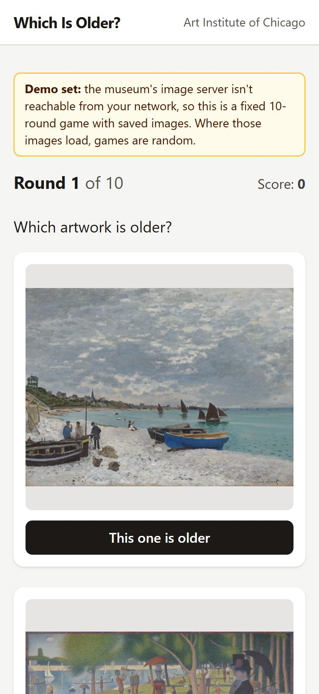

# Which Is Older?

A small art-guessing game. Two artworks from the Art Institute of Chicago appear side by side, showing images only. Click the one you think is older. The app then reveals both artworks' titles, artists and dates and tells you whether you were right. A game is 10 rounds, then a score screen.

**Play it:** https://which-is-older.vercel.app

## Screenshots

| A round | The reveal |
|---|---|
|  |  |

| Results | On a phone |
|---|---|
|  |  |

These were captured in demo mode (see [Known limitations](#known-limitations)).

## Why I built it

I wanted a project that goes beyond a tutorial: real third-party data, a real design problem, and real edge cases. The interesting problem here is not the UI, it is **building fair pairs**. A random pair of artworks is often trivially easy (a 1500s painting against a 1930s photograph) or unfairly close (two works from the same year). Most of the code that matters is in how pairs are chosen.

## Stack

- **React 19 + TypeScript**, scaffolded with Vite
- **React Router** for the home, game and results pages
- **Tailwind CSS v4** for styling
- **Vitest** for unit tests
- **Vercel** for hosting
- **No backend.** Game state lives in React state; the personal best is kept in `localStorage`.

Data comes from the [Art Institute of Chicago public API](https://api.artic.edu/docs/), which needs no key and allows browser requests.

## How pairing works

The code lives in [`src/game/pairing.ts`](src/game/pairing.ts), with all tunable numbers in [`src/game/config.ts`](src/game/config.ts).

1. **Era bands, not one big pool.** The collection is heavily weighted toward the 1800s and early 1900s. If I fetched one random pool and paired it off, ancient and medieval pieces would rarely have a sensible partner. Instead, the game fetches one pool per era band (ancient, medieval, 1400-1799, 1800s, 1900-1939), in parallel, and each band supplies a fixed share of the 10 rounds.
2. **Gap rules scale with age.** Dates for old art are fuzzy, and a 5-year gap in 1500 means nothing to a player. So each band has its own allowed gap between the two works: 5-20 years for the 1900s, 10-40 for the 1800s, 25-100 for 1400-1799, 75-250 for medieval, 100-500 for ancient.
3. **Fair questions only.** A pair is rejected if the two date ranges overlap, even if their midpoints are far apart, because "which is older?" would have no clear answer. Works with vague dates (a range wider than the band allows, such as "c. 1500-1600") are filtered out before pairing.
4. **Graceful fallback.** If a band's pool has no pair within its gap rule, the rule is relaxed in steps (never below a 2-year gap). If that still fails, the round is given to a different band. If a band's request fails twice, the game continues without it.
5. **No repeats.** An artwork can appear only once per game.
6. **BCE years** are handled as negative numbers and formatted as "300 BCE". There is no year 0, so a pair that crosses the BCE/CE line is counted one year closer than plain subtraction suggests.

The answer to each round is computed from the data, never typed in, and the left/right placement is shuffled so the older work is not predictably on one side.

### Working with the API's limits

Three things I only learned by testing the live API, and designed around:

- **Rate limit: 60 requests per minute per IP.** A first design that queried once per round would use 12-15 requests per game. The game now uses exactly **5 requests**: one 100-result query per era band.
- **Only the first 1,000 results of any query are reachable.** Paging deeper returns HTTP 403. A fixed query per era would therefore show the same artworks every game, so each band queries a random sub-window of years instead.
- **Almost nothing after 1939 is public domain** (copyright), so the "recent" end of the game stops at 1939.

### Spoiler rules

Titles often contain years, and the artist field includes birth and death years. So only the image is shown before the guess, and even the image's alt text avoids the title. Some pairs can still be guessed from fame alone; that is an accepted limit.

## Project structure

```
src/
  api/          Art Institute API client (search query, image URLs)
  game/         pairing logic, config, reducer, data cleaning, game provider
  components/   ArtworkCard, ArtworkImage, Layout, Button, StatusMessage
  pages/        HomePage, GamePage, ResultsPage
  types.ts      API response and game types
```

The pairing logic, data cleaning and game reducer are pure functions, so most of the tests need no browser and no network.

## Accessibility

Choices are real `<button>` elements with visible focus rings; keyboard focus moves to the "Next round" button after a guess; results are announced through `role="status"`; loading, error and empty states are all handled; artworks stack on phones and sit side by side on larger screens.

## Run it locally

```bash
npm install
npm run dev      # http://localhost:5173
npm test         # unit tests
npm run build    # type-check and production build
```

## Known limitations

- **Image hosting, and the demo fallback.** The museum's data API is open, but its image files are served from its main website domain (`www.artic.edu`), which sits behind Cloudflare bot protection. In testing, image requests embedded in another site's page were rejected (a plain 403, or a verification challenge that an `` tag can't complete) on both a home connection and mobile data. To keep the app playable, the game checks at the start whether the images load. If they don't, it plays a fixed 10-round **demo set** using public-domain images saved in `public/demo/`, and says so in a banner. Where the museum's images do load, every game is randomly generated. Proxying images through a server would avoid the problem, but this project is deliberately frontend-only.
- Some pairs are guessable from fame alone.
- The dataset ends at 1939 for the reasons above.

## v2 ideas

- **Difficulty modes:** change the gap rules (closer pairs for "hard", wider for "easy"). This only needs different config tables.
- **Daily puzzle:** the same 10 rounds for everyone each day. Needs a backend (or a scheduled job) to pick and store the day's pairs.
- **Global leaderboard:** needs a backend and some form of anti-cheating.
- Include more of the collection by adding a second museum API.

## Data and licensing

Artwork data and images are from the Art Institute of Chicago; only public-domain works are used. See the [API terms](https://api.artic.edu/docs/).
